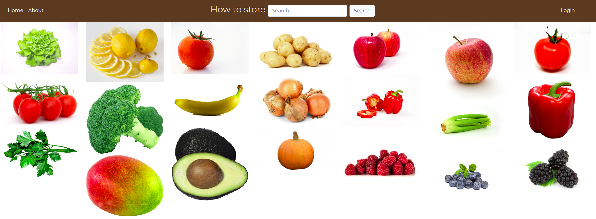

# How to store foods?

'How to store' gathers information, scattered all around the Internet, about how fruits and vegetables should be stored 
to be fresh longer.

Application offers functionalities like displaying food items and searching through them.
Additionally, registered users can add comments. Admin panel lets to manage users and accept or decline their 
comments.

## Tech stack

- Python
- Django & Django Rest Framework
- React/Redux
- PostgreSQL

## Highlight's features

- registration and authentication with e-mail password recovery
- searching bar with autocomplete
- adding comments by registered user
- pagination

## Django & React together

React part is setup manually to work with Django and it functions as a Django App. The configuration allows to 
serve all statics from Django and allows us to run both frontend and backend under a single port, 
so it makes deployment easier.

## Installation

Python and Django need to be installed

`pip install django` 

## Usage

Go to the folder  with manage.py and run

`python manage.py runserver`

Then go to the browser and enter the url http://127.0.0.1:8000/

## Main page

